<!-- markdownlint-disable MD033 MD041 MD042 -->

I'm a 17 years old programming hobbyist living in China.  
You can call me `饼干`(`cookie`).  
My character is on the right.

[-aacdf4?style=for-the-badge>)](https://blog.lgc2333.top/about)

Visits since 2023/4/12  

Expand / Collapse

## 🔍 Related

## ✨ Skills

  

  

<!--  -->

## 🌎 Social

  

  
  

## ❤️ Donate

## 🕒 Stats

<!--  -->

